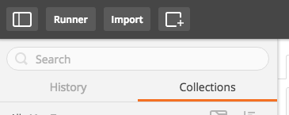
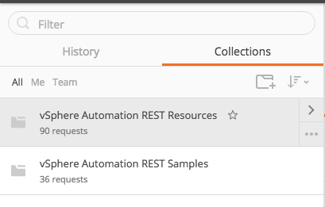
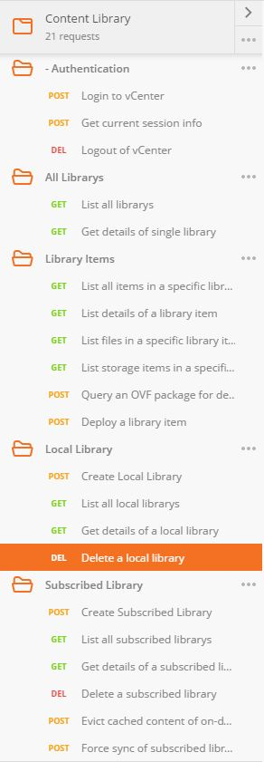

# vSphere Automation REST API Postman Resources and Samples

These three files provide API resources and example end to end scenarios that you
can import in to Postman to execute.

* [vSphere-Automation-Rest-API-Resources.postman.json](vSphere-Automation-Rest-API-Resources.postman.json) provides the
individual API resources. They are standalone requests that you can execute or use to build up an end to end workflow.
* The [vSphere-Automation-Rest-API-Samples.postman.json](vSphere-Automation-Rest-API-Samples.postman.json) do
exactly that to show some common simple use cases.
* The [vSphere-Automation-Rest-API-Appliance-Resources.postman.json](vSphere-Automation-Rest-API-Appliance-Resources.postman.json)
provides individual API resources to manage vCenter Server Appliance. They are standalone requests that you can execute
or use to build up an end to end workflow.
* The [vSphere-Automation-REST-resources-for-Content-Library.postman_collection.json](vSphere-Automation-REST-resources-for-Content-Library.postman_collection.json)
provides individual API resources to manage vCenter Content Library features. They are standalone requests that you can execute
or use to build up an end to end workflow.

## Requirements
[Postman Client](https://www.getpostman.com)

## Installation

The included .json files were built using the Postman client. It is recommended that you install the latest client from [Postman](https://www.getpostman.com).

Once installed, start Postman, and select the import button in the upper left corner:

You will see the import dialog open:

You can drag and drop the JSON files in this directory one at a time on to the
dialog area where is says Drop files here or you can select the Choose files
button to open a file chooser dialog and navigate to the location on your system
where this directory resides, and select the JSON files.

Once imported, you will see something similar to:

From here, you can expand either the resources to see the individual API surfaces
or expand the samples and see some of the ways you can string together the
individual resources to make a use case.

Content Library samples:

